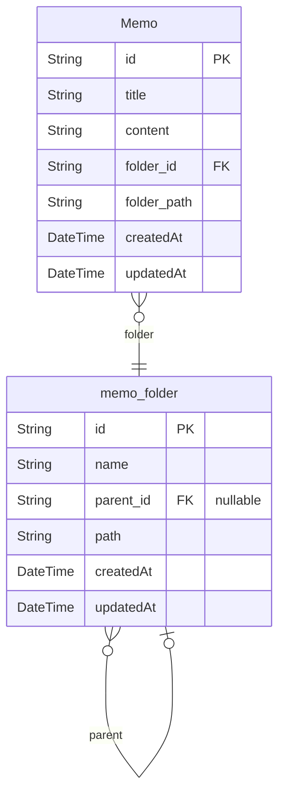

# IMKDW Dev Server
> Generated by [`prisma-markdown`](https://github.com/samchon/prisma-markdown)

- [Memo](#memo)
- [Save](#save)
- [Folder](#folder)

## Memo


### `memo_folder`

**Properties**
  - `id`: Primary key
  - `name`: Name of folder
  - `parent_id`: Identifier of parent folder
  - `path`: Path of folder (ex: "/folder1/folder1-1/folder1-1-1")
  - `createdAt`: Created time of folder
  - `updatedAt`: Updated time of folder

### `Memo`

**Properties**
  - `id`: Primary key
  - `title`: Title of memo
  - `content`: Content of memo
  - `folder_id`: Identifier of folder that memo belongs to
  - `folder_path`: Path of folder that memo belongs to
  - `createdAt`: Created time of memo
  - `updatedAt`: Updated time of memo


## Save
```mermaid
erDiagram
```

### `memo_folder`

**Properties**
  - `id`: Primary key
  - `name`: Name of folder
  - `parent_id`: Identifier of parent folder
  - `path`: Path of folder (ex: "/folder1/folder1-1/folder1-1-1")
  - `createdAt`: Created time of folder
  - `updatedAt`: Updated time of folder

### `Memo`

**Properties**
  - `id`: Primary key
  - `title`: Title of memo
  - `content`: Content of memo
  - `folder_id`: Identifier of folder that memo belongs to
  - `folder_path`: Path of folder that memo belongs to
  - `createdAt`: Created time of memo
  - `updatedAt`: Updated time of memo