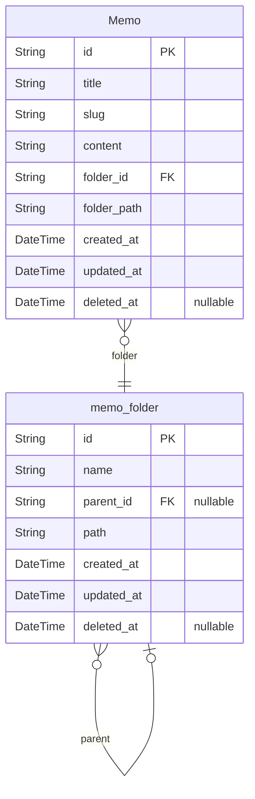

# IMKDW Dev Server
> Generated by [`prisma-markdown`](https://github.com/samchon/prisma-markdown)

- [메모](#메모)
- [메모의](#메모의)
- [Folder](#folder)

## 메모


### `Memo`

**Properties**
  - `id`: 기본 키
  - `title`: 메모 제목
  - `slug`: SEO를 위한 메모의 제목 슬러그
  - `content`: 메모 내용
  - `folder_id`: 메모가 속한 폴더 식별자
  - `folder_path`: 메모가 속한 폴더 경로
  - `created_at`: 생성 시간
  - `updated_at`: 수정 시간
  - `deleted_at`: 삭제 시간

### `memo_folder`

**Properties**
  - `id`: PK
  - `name`: 폴더 이름
  - `parent_id`: 부모 폴더 아이디
  - `path`: 폴더 경로
  - `created_at`: 생성 시간
  - `updated_at`: 수정 시간
  - `deleted_at`: 삭제 시간


## 메모의
```mermaid
erDiagram
```

### `memo_folder`

**Properties**
  - `id`: PK
  - `name`: 폴더 이름
  - `parent_id`: 부모 폴더 아이디
  - `path`: 폴더 경로
  - `created_at`: 생성 시간
  - `updated_at`: 수정 시간
  - `deleted_at`: 삭제 시간